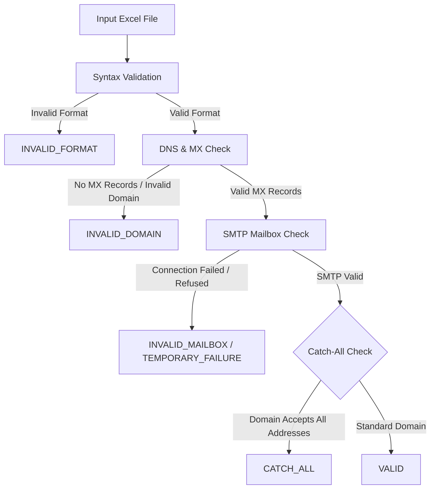

# Concurrent Email Validation System

A high-performance, concurrent, multi-stage email validation system built with Python. This tool automates the process of validating email addresses in bulk from an Excel spreadsheet by conducting syntax checking, DNS/MX resolution, direct SMTP mailbox verification, and catch-all domain detection.

---

## 🚀 Key Features

*   **Multi-Stage Verification Pipeline**: Validates emails across four distinct stages (Syntax → DNS → SMTP → Catch-All) to filter out invalid and problematic mailboxes accurately.
*   **Parallel Execution**: Uses a Python `ThreadPoolExecutor` for concurrent validation of email lists, drastically reducing processing time for bulk lists.
*   **Smart Catch-All Detection**: Identifies catch-all domains (domains that accept all incoming email addresses regardless of whether they exist) and caches the results to optimize performance and prevent IP rate-limiting.
*   **Automatic Excel Automation**: 
    *   Reads email lists dynamically from an Excel file, automatically scanning for columns matching "Mail ID" (case-insensitive).
    *   Saves outputs to beautifully styled, color-coded Excel reports using `openpyxl`.
*   **Robust Logging**: Integrated logging system that outputs status updates to both the console and daily rotated log files.

---

## 🛠️ Validation Pipeline Details



1.  **Stage 1: Syntax Validation (`syntax_validator.py`)**  
    Validates emails using RFC-compliant rules via the `email-validator` library. Checks for standard domain/local-part characters, double dots, spacing, and length.
2.  **Stage 2: DNS & MX Checker (`dns_checker.py`)**  
    Queries DNS servers using `dnspython` to check for active Mail Exchanger (MX) records. If no MX records are found, it falls back to standard A/AAAA host records.
3.  **Stage 3: SMTP Mailbox Verification (`smtp_validator.py`)**  
    Simulates sending an email by connecting to the remote mail server. It sends the `HELO/EHLO`, `MAIL FROM`, and `RCPT TO` commands to check if the specific mailbox exists without actually sending a mail message.
4.  **Stage 4: Catch-All Detector (`catch_all_detector.py`)**  
    Probes the remote server using a randomized local part (e.g., `zz_catchall_probe_xyz123@domain.com`). If the server accepts it, the domain is flagged as `CATCH_ALL`. Results are cached per-domain.

---

## ⚙️ Configuration (`config.py`)

You can customize the execution behavior inside [config.py](file:///d:/Send_Mail_Automation/email_validator_clean/config.py):

*   `SMTP_SENDER`: The email address used in the `MAIL FROM` handshake (default: `verify@yourdomain.com`).
*   `SMTP_TIMEOUT` / `SMTP_RETRIES`: Timeout duration (seconds) and retry count for SMTP handshakes.
*   `MAX_WORKERS`: Number of threads to run in parallel (default: `10`). Increase this for faster processing, or decrease to avoid blocking.
*   `CATCH_ALL_PROBE`: Local-part string used to detect catch-all domains.

---

## 📦 Requirements & Installation

### Prerequisites
*   **Python 3.10+** (requires modern Union types and generic collections annotations)

### Installation
1.  Clone this repository or navigate to the directory:
    ```bash
    cd email_validator_clean
    ```
2.  Install the required dependencies:
    ```bash
    pip install -r requirements.txt
    ```

---

## 💻 Usage

### 1. Prepare your input Excel file
Ensure your Excel spreadsheet (`.xlsx`) has a column containing email addresses. 
*   The script automatically looks for a column named **"Mail ID"** (case-insensitive, e.g., `mail id`, `Mail ID`, `MAIL ID`).
*   If no matching column name is found, it will default to reading the first column in the spreadsheet.

### 2. Run the validation
Pass the path of your input spreadsheet as a command-line argument:
```bash
python main.py path/to/your/input.xlsx
```

---

## 📊 Output Files

All output is saved to the `/output` folder:

1.  **`output/validation_results.xlsx`**:  
    The primary results file containing every validated email address. The **Mail Status** column is styled with background fills indicating status:
    *   🟢 **VALID**: Mailbox is active and verified.
    *   🟡 **INVALID_FORMAT**: Email address syntax is incorrect.
    *   🔴 **INVALID_DOMAIN**: Domain does not exist or has no mail servers.
    *   🔴 **INVALID_MAILBOX**: Mailbox does not exist on the server.
    *   🟠 **ACCESS_DENIED**: SMTP server blocked validation probes.
    *   🔵 **CATCH_ALL**: Domain accepts all emails (impossible to verify single mailbox status).
    *   🟢 **TEMPORARY_FAILURE**: Verification timed out or failed temporarily.
2.  **`output/failed_emails.xlsx`**:  
    A filtered spreadsheet containing only the failed or problematic emails (all statuses except `VALID`), making it easy to see bounce candidates at a glance.
3.  **`output/summary_report.txt`**:  
    A plain-text summary showing validation statistics and percentages.
4.  **`logs/`**:  
    Full log output containing diagnostic traces of every syntax check, DNS query, and SMTP conversation.
