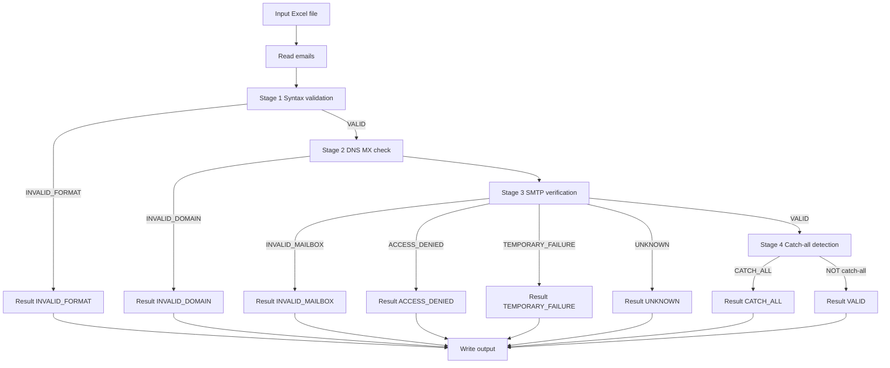

# Concurrent Email Validation System

A concurrent, multi-stage email validation pipeline that reads emails from an Excel file and produces Excel + text reports after running:

1. Syntax validation
2. DNS/MX validation (with A/AAAA fallback)
3. SMTP mailbox verification (handshake up to `RCPT TO`)
4. Catch-all detection (per-domain caching)

---

## Key features

- **Parallel execution** with `ThreadPoolExecutor`
- **Per-domain SMTP throttling** using a semaphore so a single domain never exceeds `MAX_CONCURRENT_PER_DOMAIN` concurrent SMTP actions
- **Thread-safe catch-all caching** to prevent repeated catch-all probes for the same domain
- **Excel automation**:
  - input: find a column whose header contains `mail id` (case-insensitive), otherwise use the first column
  - output: styled Excel reports via `openpyxl`
- **Structured logging** to both:
  - stdout
  - `logs/email_validator_YYYY-MM-DD.log` (size-rotated)

---

## Mermaid architecture



---

## Validation pipeline (per email)

`main.py` orchestrates validation in this order:

1. **Syntax** (`syntax_validator.validate_syntax`)
2. **DNS/MX** (`dns_checker.check_domain`)
   - Returns `INVALID_DOMAIN` when DNS definitively indicates no MX/A/AAAA
   - May return `STATUS_DNS_ERROR` on resolver/network failure
3. **SMTP verification** (`smtp_validator.verify_mailbox`)
   - Handshake up to `RCPT TO`, no email is sent
   - Concurrency limited per domain
4. **Catch-all detection** (`catch_all_detector.is_catch_all`)
   - Only executed when SMTP stage returns `VALID`
   - If catch-all is detected, the result is updated to `CATCH_ALL`

Concurrency + throttling details:

- Bulk validation runs in parallel.
- SMTP + catch-all are further gated by a **per-domain semaphore** (to reduce deliverability risk / rate limiting).

---

## Stages details

### Stage 1: Syntax validation (`syntax_validator.py`)
- Normalizes input (handles `None`/NaN, trims, Unicode NFKC, removes zero-width characters, lowercases)
- Cheap checks: length limits + basic regex pre-filter
- Full RFC-style check via `email-validator` (`validate_email(..., check_deliverability=False)`)
- Uses an `lru_cache` to avoid re-validating duplicates within the same run

### Stage 2: DNS/MX checker (`dns_checker.py`)
- Uses `dnspython`
- Prefer MX records:
  - If MX exists => returns `VALID` and an ordered `mx_hosts` list
- If MX is absent:
  - Resolves A/AAAA and treats it as implicit MX (`VALID` with `[domain]`)
- Clear distinction:
  - Definitive “no MX/A/AAAA” => `INVALID_DOMAIN`
  - Resolver/network cannot answer => `STATUS_DNS_ERROR` (string is defined in code if not present in config)

### Stage 3: SMTP mailbox verification (`smtp_validator.py`)
- For each MX host (in priority order), attempts an SMTP handshake:
  - connect on `SMTP_PORT`
  - `EHLO/HELO` using `SMTP_HELO_DOMAIN`
  - `MAIL FROM` using `SMTP_SENDER`
  - `RCPT TO` using the target email
  - parses the SMTP response code
  - immediately `QUIT`
- Retries transient connection failures using `SMTP_RETRIES` (+ backoff)

Status mapping is derived from SMTP 3-digit reply codes:
- `250/251` => `VALID`
- `550/551/553/554` => `INVALID_MAILBOX`
- `503/530/535` => `ACCESS_DENIED`
- `421/450/451/452` => `TEMPORARY_FAILURE`
- anything else => `UNKNOWN`

### Stage 4: Catch-all detection (`catch_all_detector.py`)
- Builds a probe address:
  - local part starts with `CATCH_ALL_PROBE` and appends a random suffix
- Probes the domain with the same SMTP validator
- If the probe is accepted (`VALID`) => mark domain as `CATCH_ALL`
- If the probe is cleanly rejected => not catch-all
- If ambiguous (timeouts/temp/unknown) => returns `None` (caller will not override `VALID`)

---

## Configuration (`config.py`)

All tunables live in `config.py`, including:

- **SMTP**
  - `SMTP_SENDER`
  - `SMTP_HELO_DOMAIN`
  - `SMTP_PORT`
  - `SMTP_TIMEOUT`, `SMTP_RETRIES`, `SMTP_RETRY_DELAY`, `SMTP_RETRY_BACKOFF`
- **DNS**
  - `DNS_TIMEOUT`, `DNS_RETRIES`
- **Performance**
  - `MAX_WORKERS`
- **Catch-all**
  - `CATCH_ALL_PROBE` and `CATCH_ALL_PROBE_SUFFIX_LENGTH`

File/report locations (defined in `config.py`):
- `LOG_DIR`: `logs/`
- `OUTPUT_DIR`: `output/`
- `OUTPUT_EXCEL`: `output/validation_results.xlsx`
- `FAILED_EXCEL`: `output/failed_emails.xlsx`
- `SUMMARY_REPORT`: `output/summary_report.txt`

CLI overrides supported by `main.py`:
- `--workers N` => overrides `MAX_WORKERS`
- `--domain-concurrency N` => overrides `MAX_CONCURRENT_PER_DOMAIN` (if present; otherwise `main.py` defaults to 3)

---

## Requirements & Installation

- Python 3.10+

Install dependencies:
```bash
pip install -r requirements.txt
```

---

## Usage

### 1) Input Excel
Your `.xlsx` should contain a column whose header contains `mail id` (case-insensitive).
- If none is found, the first column is used.

### 2) Run
```bash
python main.py path/to/your/input.xlsx
```

Optional overrides:
```bash
python main.py path/to/your/input.xlsx --workers 20 --domain-concurrency 3
```

Notes:
- Pressing `Ctrl+C` stops issuing new work and writes partial results.

---

## Output

Outputs are written into `output/`:

1. **`output/validation_results.xlsx`**
   - Columns:
     - `Mail ID`
     - `Mail Status`
     - `Validation Reason`
     - `SMTP Response`
   - Status column is color-filled using `openpyxl`:
     - `VALID`, `INVALID_FORMAT`, `INVALID_DOMAIN`, `INVALID_MAILBOX`, `ACCESS_DENIED`, `CATCH_ALL`, `TEMPORARY_FAILURE`, `UNKNOWN`

2. **`output/failed_emails.xlsx`**
   - Same format, filtered to rows where `Mail Status != VALID`

3. **`output/summary_report.txt`**
   - Plain-text counts + percentages by status

Logs:
- `logs/email_validator_YYYY-MM-DD.log` (stdout + rotating file handler)
